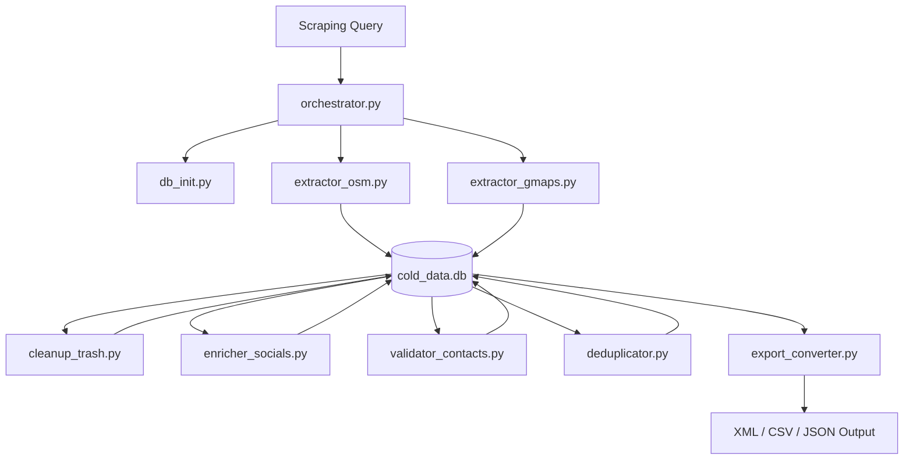

# Cold Data Scrapper (CDS)

A modular, database-centric pipeline to extract, validate, enrich, deduplicate, and export local business lead data. Outputs Excel-compatible XML, CSV, and JSON.

---

## Architecture

The pipeline consists of independent modular Python scripts coordinating through a shared SQLite database (`cold_data.db`). A unified Orchestrator CLI wraps the modules, outputting JSON status logs for easy dashboard integration.



---

## Core Modules

1. **Database Setup (`db_init.py`)**
   - Initializes database schema (`runs` and `leads` tables).
2. **OSM Extractor (`extractor_osm.py`)**
   - Resolves search regions via Nominatim geocoding and queries Overpass API mirrors.
3. **Google Maps Extractor (`extractor_gmaps.py`)**
   - Supports SerpApi Google Maps search (fast, reliable) and fallback Playwright browser automation scraper.
4. **Trash Cleanup (`cleanup_trash.py`)**
   - Removes unnamed, generic, or junk businesses from leads (marks as duplicates).
5. **Social Contacts Enricher (`enricher_socials.py`)**
   - Crawls business websites or queries DuckDuckGo search to extract public emails, Instagram handles, Facebook pages, and WhatsApp contacts.
6. **Contact Validator (`validator_contacts.py`)**
   - Formats phone numbers, creates direct WhatsApp chat links, and checks email domain validity using native Linux DNS host checks.
7. **Lead Deduplicator (`deduplicator.py`)**
   - Finds geographic duplicates using Haversine formula and name similarity. Merges contacts across sources (GMaps + OSM).
8. **Export Exporter (`export_converter.py`)**
   - Reads clean leads from the database and exports them to XML, CSV, and JSON.
9. **CLI Orchestrator (`orchestrator.py`)**
   - Standardized interface to run single stages or trigger the entire pipeline end-to-end. Outputs JSON.

---

## Setup & Execution

### 1. Create Virtual Environment & Install Dependencies
```bash
# Create and activate virtual environment
python3 -m venv .venv
source .venv/bin/activate

# Install required packages
pip install -r requirements.txt

# Install Playwright browser (for fallback Google Maps scraper)
playwright install chromium
```

### 2. Setup Environment
```bash
# Copy the example env file and fill in your API keys
cp env.example .env
```

### 3. Initialize Database
```bash
./orchestrator.py init
```

### 4. Run End-to-End Pipeline
Runs extraction, social media enrichment, phone/email validation, geographical deduplication, and exports the clean dataset to XML & CSV:
```bash
./orchestrator.py run-all -q "cafe" -r "Jakarta Selatan" -o jaksel_cafes
```

### 5. Run Individual Modules
```bash
# Run OSM extractor only
./orchestrator.py extract-osm -q "restaurant" -r "Bandung" -o bandung_food

# Run Google Maps extractor only (using SerpApi key)
./orchestrator.py extract-gmaps -q "hotel" -r "Bali" -k YOUR_SERPAPI_KEY -o bali_hotels

# Enrich socials for all new leads in DB
./orchestrator.py enrich

# Validate contact phone/email syntax and DNS records
./orchestrator.py validate

# Deduplicate and merge records in DB
./orchestrator.py dedup

# Export clean database leads
./orchestrator.py export -o output_data -q "cafe" -r "Jakarta Selatan"
```

### 6. Run Dashboard Web UI
Launches a Flask web server on port 8080 to interactively trigger runs, view leads, and export datasets:
```bash
python3 server.py
```
Open `http://localhost:8080` in your web browser.

## Output Formats

- **CSV**: Encoded with UTF-8 BOM, allowing immediate double-click import into Excel with correct character displays.
- **XML**: Formatted semantic data tree ready for spreadsheet import schemas.
