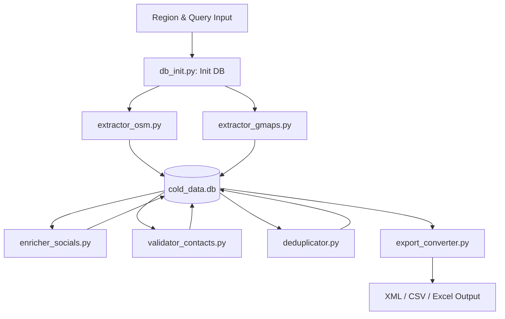

# Cold Data Pipeline & Dashboard - Development Roadmap

This document lists the plan, architecture, and task list for building the modular cold data gathering pipeline, preparing it for dashboard control.

---

## 🛠️ Architecture Overview

The system uses a modular, database-centric pipeline built on SQLite. Each stage is an independent Python script that reads from and writes to the SQLite database (`cold_data.db`). This layout allows any dashboard (web/desktop) to trigger, monitor, and query progress asynchronously.

---

## 📅 Roadmap & Tasks

### Phase 1: Database & Extraction (Completed)
- [x] **Database Setup (`db_init.py`)**
  - Create `runs` table (track extraction jobs).
  - Create `leads` table (unified business schema with fields for geolocation, contact details, social links, source details, validation state, and custom tags).
- [x] **OSM / Overpass Extractor (`extractor_osm.py`)**
  - Extract names, addresses, contacts, coordinates, and hours.
  - Automatically update `leads` and `runs` tables.
- [x] **Google Maps Scraper (`extractor_gmaps.py`)**
  - Zero-API-key fallback + browser automation using Playwright + SerpApi wrapper.
  - Extract business name, phone, address, and coordinates.

### Phase 2: Enrichment & Validation (Completed)
- [x] **Social Media & Web Enricher (`enricher_socials.py`)**
  - Scan the business website or search DDG to discover Instagram, Facebook, emails, and WhatsApp.
- [x] **Contact Validator (`validator_contacts.py`)**
  - Normalize and validate phone numbers and email MX records via native host command.

### Phase 3: Normalization & Export (Completed)
- [x] **Data Deduplicator & Merger (`deduplicator.py`)**
  - Fuzzy name matching and geographical distance matching (Haversine).
  - Merge OSM and Google Maps data, keeping the most complete fields.
- [x] **Export Converter (`export_converter.py`)**
  - Read from database and export clean datasets to XML and CSV.

### Phase 4: Dashboard Integration (Completed)
- [x] **CLI Orchestrator (`orchestrator.py`)**
  - Unified controller script to run pipeline steps with CLI flags and print JSON statuses.
- [x] **Web Dashboard (Flask + HTML/CSS/JS + Tailwind CSS + Font Awesome)**
  - Interactive UI to:
    - Launch and monitor new extraction jobs.
    - View, search, and edit database records.
    - Export clean datasets to CSV/XML with one click.

### Phase 5: Production-Ready Cold Research (Pending)
- [ ] **SerpApi / Playwright Proxy System**
  - Add rotating proxy configuration support to avoid IP blocks during high-volume Maps scraping.
- [ ] **Deep Contact Web Crawler**
  - Implement sub-page crawler to scan common contacts locations (`/contact`, `/about`, `/reach-us`, `/team`) if the homepage yields no emails or phones.
- [ ] **SMTP Sockets Handshake Check**
  - Upgrade email verifier to perform interactive SMTP handshake checks to detect if a specific mailbox exists (beyond just domain MX checks).
- [ ] **Outreach Status & Campaign Tracker**
  - Support outreach lifecycle tracking in DB & UI (`Not Contacted`, `Emailed`, `WhatsApped`, `Interested`, `Replied`, `Unsubscribed`).
- [ ] **Lead Scoring / Prioritization Engine**
  - Calculate opportunity scores to bubble up highest quality outreach candidates (e.g., high-traffic local businesses with missing websites, incorrect phones, or invalid social links).
- [ ] **Automated Cron Scheduling**
  - Support cron-based scheduled scraper runs to automatically gather new leads weekly/monthly.
- [ ] **HubSpot / Salesforce Integration Webhooks**
  - Build pipeline webhooks to sync qualified/verified leads directly to CRM databases.
